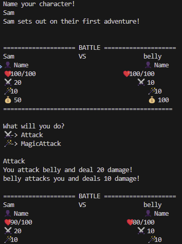

# rust-cli-game
A Very basic CLI game written in Rust as practice



# Build and Run
You can build and run the game yourself by cloning the repo and running:
```
cargo run
```

# Comments
<p>While very basic, building this program was great for learning Rust. It allowed me to focus on learning Rust syntax while writing a program that was easy to build, without the handholding of tutorials.</p>
<br>
There are many missing features still:

- Random Enemy Generation
- Out of battle content
- Upgrading your character

However the game is in a playable state, even if it's quite tiny.